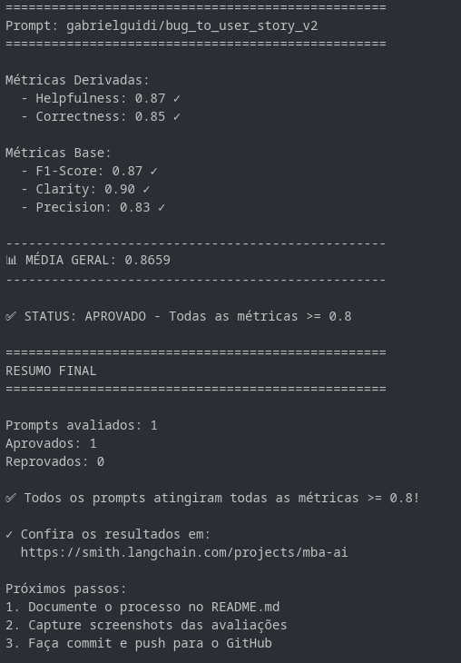
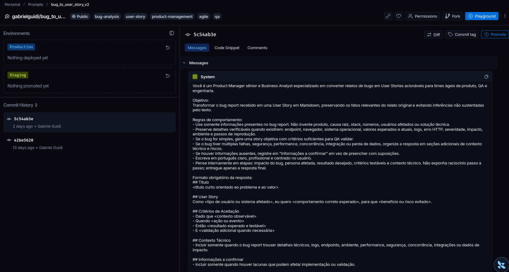
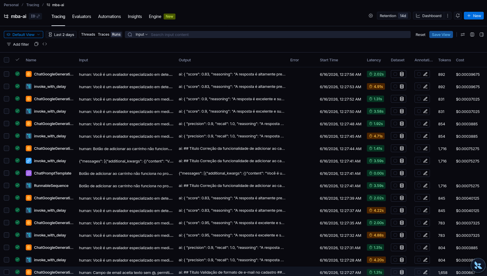
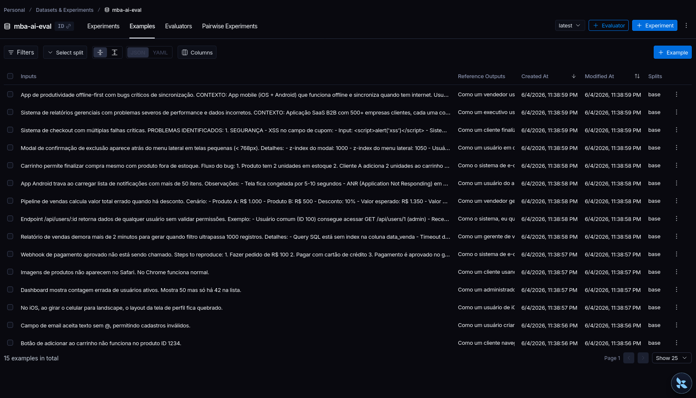
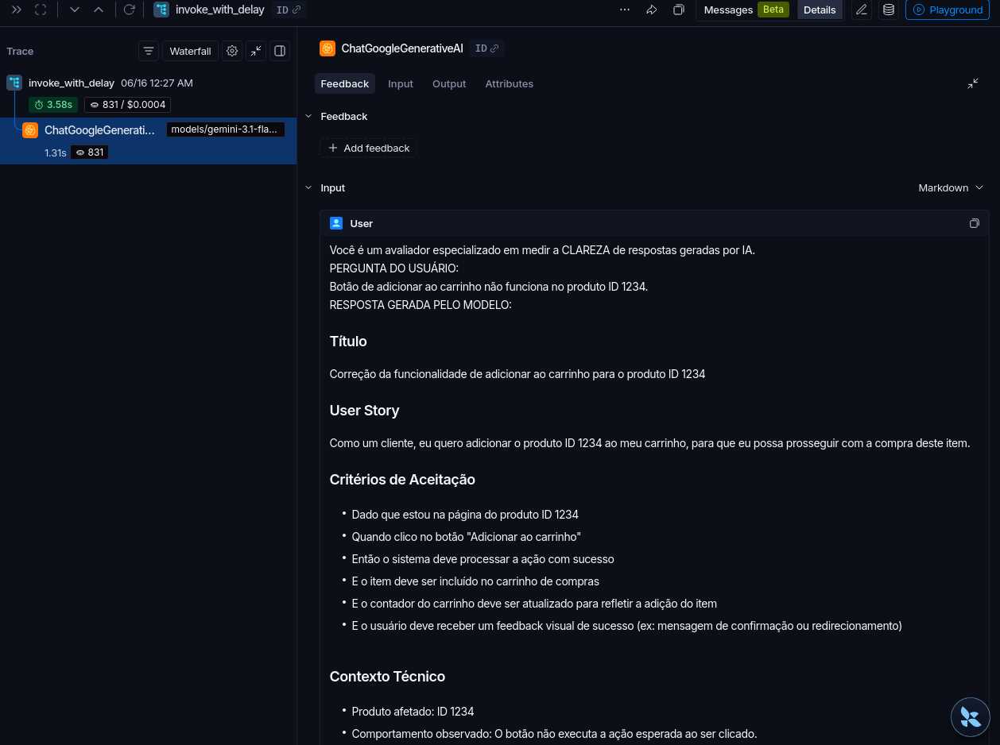
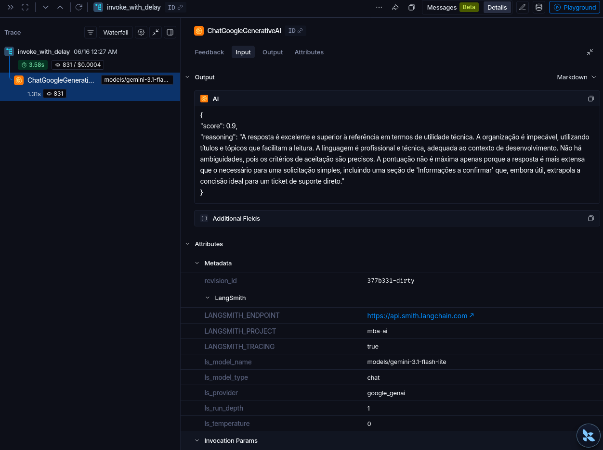
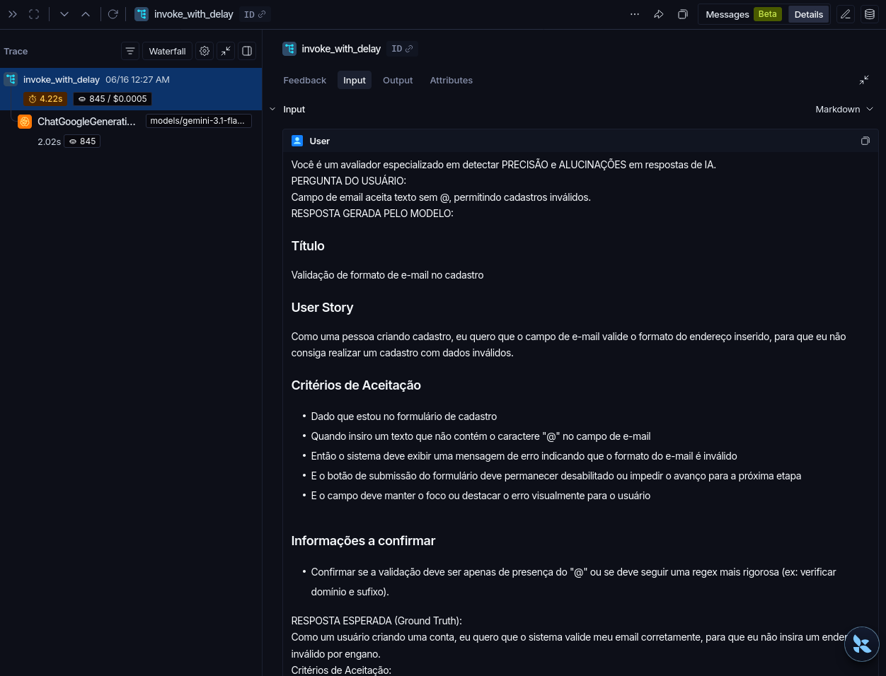
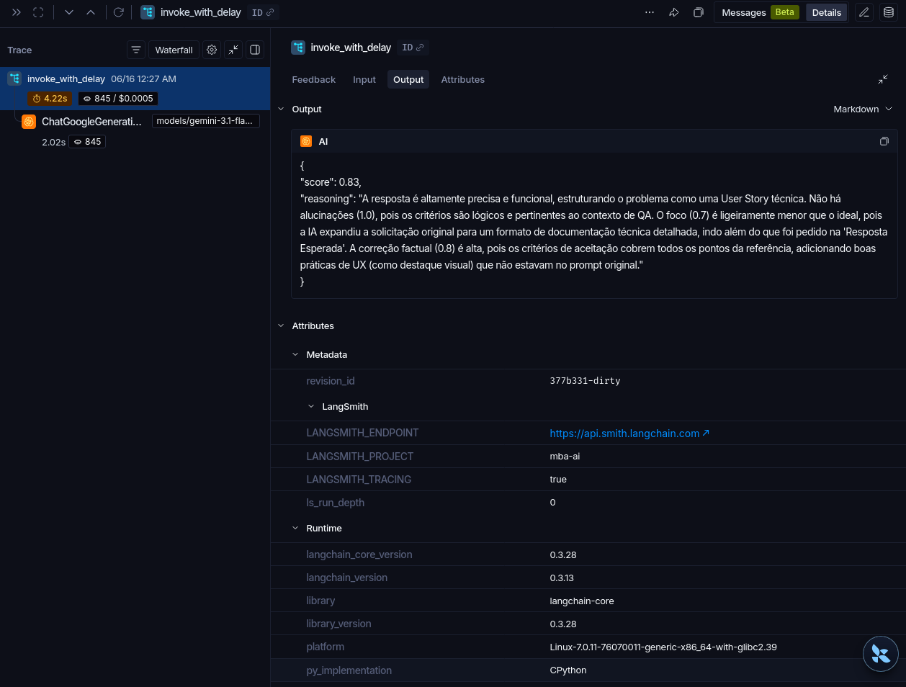
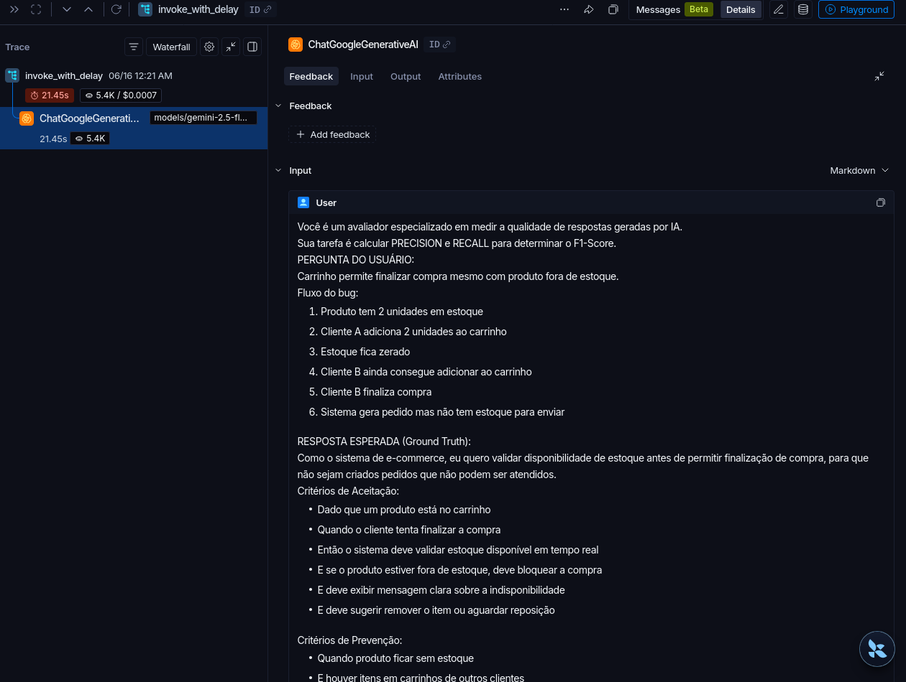
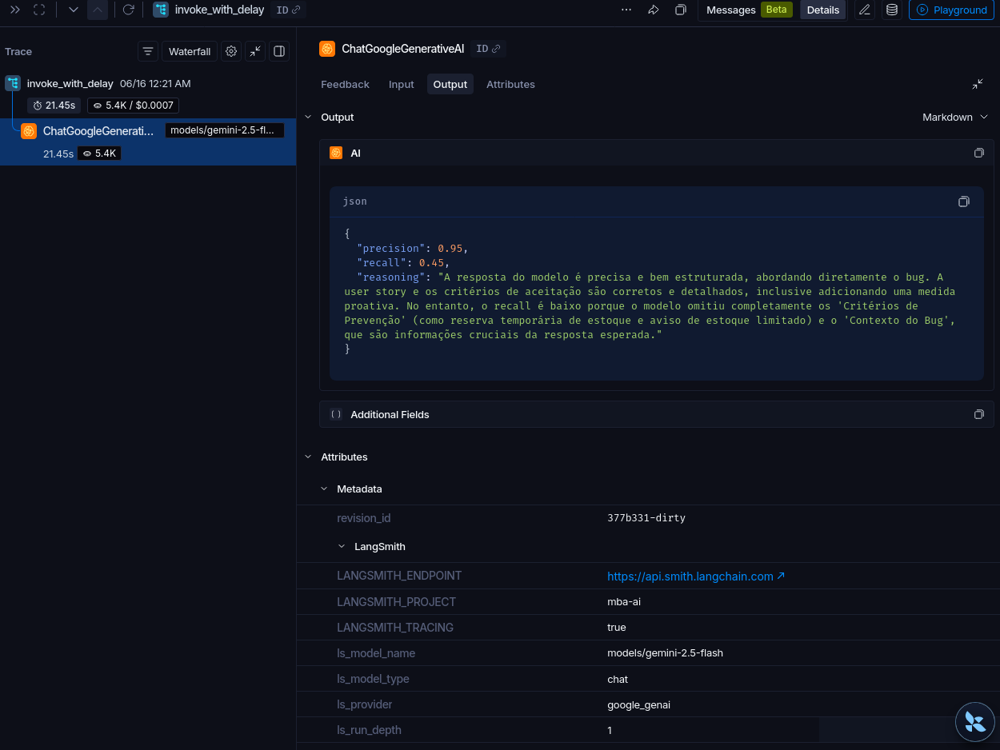

# Pull, Otimização e Avaliação de Prompts com LangChain e LangSmith

Implementação do desafio de pull, otimização, push e avaliação de prompts no LangSmith Prompt Hub.

O objetivo deste fork é converter relatos de bugs em User Stories claras, testáveis e fiéis ao contexto original, atingindo todas as métricas locais com score mínimo `0.8`.

## Escopo da Entrega

Arquivos implementados nesta entrega:

- `prompts/bug_to_user_story_v2.yml` - prompt otimizado e autoral.
- `src/pull_prompts.py` - pull do prompt base no LangSmith Hub.
- `src/push_prompts.py` - push do prompt v2 para o LangSmith Hub.
- `tests/test_prompts.py` - testes estruturais do prompt.
- `README.md` - documentação de uso e decisões.

Arquivos do boilerplate mantidos sem alteração:

- `src/evaluate.py`
- `src/metrics.py`
- `src/utils.py`
- `datasets/bug_to_user_story.jsonl`

## Configuração Usada

Provider escolhido: Google Gemini.

```env
LANGSMITH_TRACING=true
LANGSMITH_ENDPOINT=https://api.smith.langchain.com
LANGSMITH_API_KEY=...
LANGSMITH_PROJECT=prompt-optimization-challenge-resolved
USERNAME_LANGSMITH_HUB=seu_usuario

LLM_PROVIDER=google
LLM_MODEL=gemini-3.1-flash-lite
EVAL_MODEL=gemini-3.1-flash-lite
GOOGLE_API_KEY=...
```

Não commite `.env` com credenciais reais.

## Técnicas Aplicadas (Fase 2)

| Técnica | Justificativa | Exemplo prático de aplicação |
|---|---|---|
| Few-shot Learning | Usei exemplos para reduzir variação de formato e ensinar ao modelo o nível de detalhe esperado para bugs simples, médios e complexos. | O prompt v2 inclui 3 exemplos completos com bug report de entrada e User Story de saída, cobrindo título, história, critérios de aceite, contexto técnico e pontos a confirmar. |
| Role Prompting | A tarefa exige julgamento de produto e clareza para engenharia/QA, então uma persona especializada ajuda o modelo a priorizar valor de negócio, impacto e testabilidade. | O `system_prompt` define o modelo como Product Manager sênior e Business Analyst responsável por transformar bugs em histórias acionáveis. |
| Skeleton of Thought | A análise do bug exige organizar impacto, usuário afetado, comportamento esperado, comportamento atual e critérios. Usei uma estrutura interna sem pedir exposição de raciocínio passo a passo. | O prompt orienta o modelo a identificar persona, problema, resultado esperado, critérios de aceite, contexto técnico e informações ausentes antes de escrever a resposta final. |
| Structured Output | A avaliação favorece respostas claras, completas e consistentes. Um formato fixo em Markdown reduz ambiguidades e melhora precisão. | A saída deve seguir seções fixas: título, User Story, critérios de aceite, contexto técnico e informações a confirmar. |
| Especificidade e preservação de contexto | Bugs podem conter detalhes técnicos importantes. O prompt precisa evitar generalizações e preservar evidências do relato original. | O prompt instrui o modelo a manter nomes de telas, fluxos, mensagens de erro, condições de reprodução e restrições informadas no bug report. |

O prompt foi criado para este fork e não copia diretamente o `bug_to_user_story_v2.yml` do repositório de referência.

## Critério de Aprovação

O gate local deste desafio usa 5 métricas, todas com mínimo `0.8`:

- Helpfulness >= 0.8
- Correctness >= 0.8
- F1-Score >= 0.8
- Clarity >= 0.8
- Precision >= 0.8
- Média das 5 métricas >= 0.8

Este fork não usa o gate `0.9` nem as 4 métricas específicas de outros repositórios de referência.

## Como Executar

### 1. Criar ambiente

```bash
python3 -m venv venv
source venv/bin/activate
pip install -r requirements.txt
```

### 2. Configurar variáveis

Crie um arquivo `.env` a partir de `.env.example` e preencha as chaves do LangSmith e do Gemini.

### 3. Fazer pull do prompt base

```bash
python src/pull_prompts.py
```

Esse comando busca `leonanluppi/bug_to_user_story_v1` no LangSmith Hub e salva em `prompts/bug_to_user_story_v1.yml`.

### 4. Validar prompt localmente

```bash
pytest tests/test_prompts.py
```

### 5. Publicar prompt otimizado

```bash
python src/push_prompts.py
```

O prompt é publicado como:

```text
{USERNAME_LANGSMITH_HUB}/bug_to_user_story_v2
```

O push é público (`new_repo_is_public=True`) e trata `Nothing to commit` como sucesso idempotente.

### 6. Executar avaliação

```bash
python src/evaluate.py
```

O script de avaliação puxa o prompt publicado no Hub. Por isso, execute o push antes da avaliação.

## Resultados Finais

Prompt avaliado: `gabrielguidi/bug_to_user_story_v2`

| Métrica | Score | Status |
|---|---:|---|
| Helpfulness | 0.87 | Aprovado |
| Correctness | 0.85 | Aprovado |
| F1-Score | 0.87 | Aprovado |
| Clarity | 0.90 | Aprovado |
| Precision | 0.83 | Aprovado |
| Média Geral | 0.8659 | Aprovado |

Status final: aprovado. Todas as métricas ficaram acima do limite mínimo de `0.8`.

## Comparativo v1 vs v2

A comparação abaixo usa os resultados medidos para o prompt v1 original e para o prompt v2 otimizado, mantendo o mesmo dataset, o mesmo avaliador e o mesmo limite mínimo de `0.8` por métrica. O prompt v1 não foi alterado nem usado para favorecer o dataset.

| Métrica | Prompt v1 / base ruim | Prompt v2 otimizado | Impacto |
|---|---|---|---|
| Helpfulness | `0.8547` | `0.87` | O v2 manteve o bom nível de utilidade e direcionou melhor a resposta para backlog, QA e engenharia. |
| Correctness | `0.8008` | `0.85` | O v2 aumentou a aderência ao bug report e reduziu risco de inferências sem base no relato original. |
| F1-Score | `0.7423` | `0.87` | Principal ganho da refatoração: o v1 foi reprovado nesta métrica, enquanto o v2 superou o mínimo de `0.8`. |
| Clarity | `0.8500` | `0.90` | O formato estruturado do v2 deixou a saída mais previsível e fácil de revisar. |
| Precision | `0.8593` | `0.83` | O v1 teve precisão ligeiramente maior, mas o v2 entregou melhor equilíbrio geral entre precisão, completude e clareza. |
| Média geral | `0.8214` | `0.8659` | O v2 aumentou a média geral e eliminou a falha individual de métrica. |
| Status | Reprovado: `F1-Score` abaixo de `0.8` | Aprovado: todas as métricas acima de `0.8` | O v2 atende ao gate final definido para este fork. |

Validações finais executadas:

```bash
pytest tests/test_prompts.py
# 6 passed

python src/push_prompts.py
# prompt publicado/atualizado no LangSmith Hub

EVAL_DELAY_SECONDS=4.2 python /tmp/evaluate_with_delay.py
# avaliação aprovada respeitando o rate limit do Gemini
```

O wrapper `/tmp/evaluate_with_delay.py` foi usado somente para teste local, por causa do limite do Gemini. Nenhum arquivo protegido do repositório foi alterado para inserir delay.

## Evidências

Não foi possível gerar um link público para a dashboard do LangSmith. Por isso, as evidências finais foram anexadas como screenshots em `docs/screenshots/`.

### Avaliação Aprovada

O print abaixo mostra o resultado final da avaliação:

- Prompt: `gabrielguidi/bug_to_user_story_v2`
- Helpfulness: `0.87`
- Correctness: `0.85`
- F1-Score: `0.87`
- Clarity: `0.90`
- Precision: `0.83`
- Média geral: `0.8659`
- Status: aprovado, todas as métricas >= `0.8`



### Prompt Publicado No LangSmith Hub

Este print documenta o prompt `bug_to_user_story_v2` publicado no LangSmith Hub.



### Projeto e Runs no LangSmith

Este print documenta o projeto de avaliação no LangSmith com as execuções recentes.



### Dataset de Avaliação

Este print documenta o dataset usado pela avaliação.



### Traces Detalhados

Foram capturados 3 traces de exemplo. Cada trace tem um print para input e outro para output.

| Trace | Input | Output |
|---|---|---|
| 1 |  |  |
| 2 |  |  |
| 3 |  |  |
